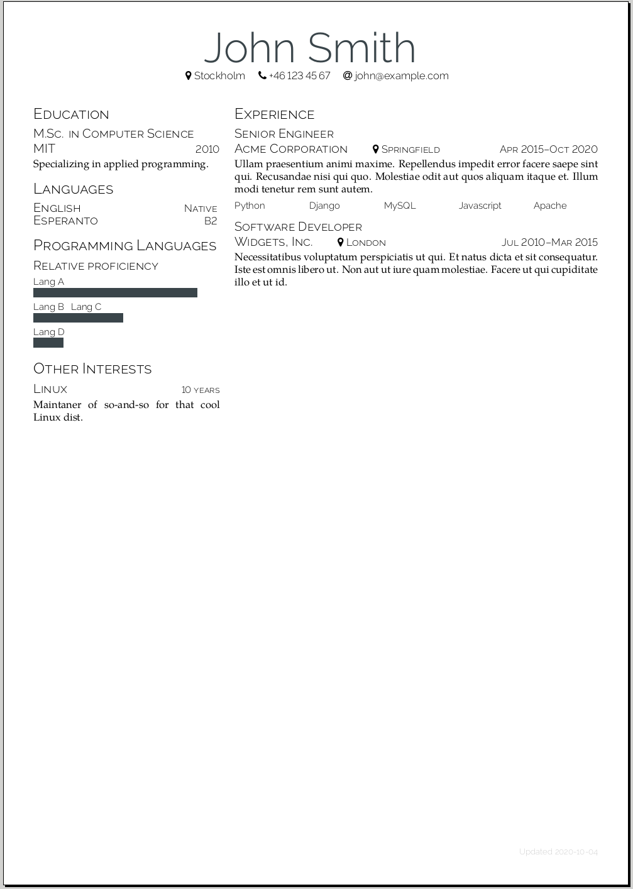

Linderoth CV
============
Yet another LaTeX CV template. Single-page, minimalistic design in a
configurable two-column layout.


Why yet another CV template?
----------------------------
When I needed to update my old mess of a CV after 5 years, I couldn't get it to
look decent. I got tired of hunting for spacing bugs and decided to start over.
This is my first stab at writing a LaTeX class or package.

I got my inspiration from these templates:

- [Deedy Resume](https://github.com/deedy/Deedy-Resume)
- [Modern Simple CV](https://github.com/latex-ninja/modern-simple-cv)
- [Data Engineer Resume](https://github.com/opensorceror/Data-Engineer-Resume-LaTeX)


Example
-------


Source in [example.tex](./example.tex). Compiled as a PDF in [example.pdf](./example.pdf).


Dependencies
------------
- A modern TeX Live distribution
- XeLaTeX
- latexmk (optional)
- GNU Make (optional)


How to build
------------
Clone the repo and put your own `.tex` file(s) in the root. I like to have a
separate git branch for changes to the content of my CV.

To build, run `make`.

If you prefer to build manually, without `make` and `latexmk`, this command worked for me:
```
xelatex -halt-on-error cv.tex
```

The build process usually creates some intermediary files, logs etc., they can
be cleaned up with `make clean`.


How it works
------------

### Basic sctructure
The document has three environments, a header `lcvheader` with your name and optionally something else. Below that, two columns, a left column `lcvleftcolumn` and a right column `lcvrightcolumn`. These columns are essentially LaTeX `minipage` environments. This is where your content goes.

```latex
\documentclass{linderothcv}

\begin{document}

\begin{lcvheader}[name=John Smith]
    ...
\end{lcvheader}


\begin{lcvleftcolumn}
    ...
\end{lcvleftcolumn}


\begin{lcvrightcolumn}
    ...
\end{lcvrightcolumn}

\end{document}
```

### Content

Sections work like in LaTeX's `article` class (which this class is based on), e.g.:
```latex
\section{Experience}
```

The main Job macro is built using `\subsection`. Parameters `location` and `to` are optional and can be omitted.
```latex
\lcvjob{
    company=Acme Corporation,
    position=Senior Engineer,
    from=Apr 2015,
    to=Oct 2020,
    location=Springfield,
}
```

There's a customized `multicols` + `itemize` environment suitable for buzzwords. Tell it how many columns you want and it'll try to fit the items. If it looks wonky the words probably didn't fit, try adjusting the number of columns.
```latex
\begin{lcvitemize}[columns=5]
    \item[] Python
    \item[] Django
    \item[] MySQL
    \item[] Javascript
    \item[] Apache
\end{lcvitemize}
```

There are two macros for smaller structured items, `\lcvpair` and `\lcvmisc`. The first, `\lcvpair`, is meant for listing things. The second, `\lcvmisc`, is built on `\subsection` and will have spacing as a subsection. Either the first or the second parameter to these macros can be omitted.
```latex
\lcvpair{English}{Native}

\lcvmisc{Linux}{10 years}

\lcvpair{List item}{}
\lcvmisc{}{right-justified}
```

The macro `\lcvskillbar{text}{length}` draws a "skillbar" under the text provided. You may want to manually end the paragraph with `\\` before the next skillbar, to keep them on separate lines. Redefine the colour `skillbar` to change colour.
```latex
\lcvskillbar{Lang A}{5.5} \\
\lcvskillbar{Lang B ~ Lang C}{3} \\
\lcvskillbar{Lang D}{1}
```


License
-------
MIT License

Copyright (c) 2020 Oscar Linderoth

Permission is hereby granted, free of charge, to any person obtaining a copy
of this software and associated documentation files (the "Software"), to deal
in the Software without restriction, including without limitation the rights
to use, copy, modify, merge, publish, distribute, sublicense, and/or sell
copies of the Software, and to permit persons to whom the Software is
furnished to do so, subject to the following conditions:

The above copyright notice and this permission notice shall be included in all
copies or substantial portions of the Software.

THE SOFTWARE IS PROVIDED "AS IS", WITHOUT WARRANTY OF ANY KIND, EXPRESS OR
IMPLIED, INCLUDING BUT NOT LIMITED TO THE WARRANTIES OF MERCHANTABILITY,
FITNESS FOR A PARTICULAR PURPOSE AND NONINFRINGEMENT. IN NO EVENT SHALL THE
AUTHORS OR COPYRIGHT HOLDERS BE LIABLE FOR ANY CLAIM, DAMAGES OR OTHER
LIABILITY, WHETHER IN AN ACTION OF CONTRACT, TORT OR OTHERWISE, ARISING FROM,
OUT OF OR IN CONNECTION WITH THE SOFTWARE OR THE USE OR OTHER DEALINGS IN THE
SOFTWARE.
